# Documentação do Banco de Dados

> Sistema de Controle de Unidade Socioeducativa — Google Apps Script + Google Sheets

O "banco de dados" desta aplicação é a própria planilha do Google Sheets vinculada ao
projeto Apps Script. Cada aba (sheet) funciona como uma tabela relacional, com a
primeira coluna normalmente atuando como chave primária (`ID`) numérica, gerada pela
função `nextId()` (maior ID atual + 1). Não há um SGBD tradicional: toda leitura,
validação e integridade referencial é feita em código (`Code.gs`), já que o Google
Sheets não impõe chaves estrangeiras, `UNIQUE`, nem *constraints*.

## Índice

- [Modelo Entidade-Relacionamento](#modelo-entidade-relacionamento)
- [Convenções gerais](#convenções-gerais)
- [Tabelas](#tabelas)
  - [Socioeducandos](#socioeducandos)
  - [Admissoes](#admissoes)
  - [Fugas](#fugas)
  - [Cursos](#cursos)
  - [CursoMatriculas](#cursomatriculas)
  - [CursoEventos](#cursoeventos)
  - [Saidas](#saidas)
  - [SaidaMatriculas](#saidamatriculas)
  - [Atendimentos](#atendimentos)
  - [Trabalhos](#trabalhos)
  - [VisitasTerritoriais](#visitasterritoriais)
  - [Familiares](#familiares)
  - [TiposAtendimento](#tiposatendimento)
  - [InteressesCurso](#interessescurso)
- [Abas legadas (histórico de migrações)](#abas-legadas-histórico-de-migrações)
- [Padrões de relacionamento N:N](#padrões-de-relacionamento-nn)
- [Integridade e limitações do modelo](#integridade-e-limitações-do-modelo)

---

## Modelo Entidade-Relacionamento

```mermaid
erDiagram
  SOCIOEDUCANDOS {
    number ID_SUASE PK
    string Nome
    date Data_de_Nascimento
    string Escolaridade
    string Email_Profissional
    string Senha_Profissional_Criptografada
    datetime Registrado_em
    string Criado_por
    datetime Atualizado_em
    string Atualizado_por
    datetime Deletado_em
    string Deletado_por
  }

  ADMISSOES {
    number ID PK
    number ID_Socioeducando FK
    date Data_Admissao
    date Data_Desligamento
    datetime Registrado_em
    string Criado_por
    datetime Atualizado_em
    string Atualizado_por
    datetime Deletado_em
    string Deletado_por
  }

  FUGAS {
    number ID PK
    number ID_Socioeducando FK
    string Tipo "Fuga | Evasão"
    date Data_Saida
    date Data_Retorno
    string Observacoes
    datetime Registrado_em
    string Criado_por
    datetime Atualizado_em
    string Atualizado_por
    datetime Deletado_em
    string Deletado_por
  }

  CURSOS {
    number ID PK
    string Tipo_de_Curso
    string Nome_do_Curso
    date Data_Inicio
    string Horario_Inicio
    date Data_Termino
    string Horario_Termino
    string Dias_da_Semana "CSV de 0-6"
    string Instituicao
    string Local "Interno | Externo"
    number Vagas
    date Data_Limite_Inscricao
    string Observacoes
    datetime Registrado_em
    string Criado_por
    datetime Atualizado_em
    string Atualizado_por
    datetime Deletado_em
    string Deletado_por
  }

  CURSOMATRICULAS {
    number ID PK
    number ID_Curso FK
    number ID_Socioeducando FK
    boolean Matriculado
    string Tipo_de_Termino "Desistente | Concluido"
    date Data_de_Termino
    boolean Certificado
    string Observacoes
    datetime Registrado_em
    string Criado_por
    datetime Atualizado_em
    string Atualizado_por
    datetime Deletado_em
    string Deletado_por
  }

  CURSOEVENTOS {
    number ID PK
    number ID_Curso_Matricula FK
    date Data
    boolean Ausente
    string Observacoes
    datetime Registrado_em
    string Criado_por
    datetime Atualizado_em
    string Atualizado_por
    datetime Deletado_em
    string Deletado_por
  }

  SAIDAS {
    number ID PK
    string Local
    string Tipo "Cultural | Familiar | Lazer | Esportiva | Descida para casa | Outros"
    datetime Data_Hora_Ida
    datetime Data_Hora_Volta
    string Conducao "Ônibus | Escolta | Acompanhado"
    string Nome_Acompanhante
    string Observacoes
    datetime Registrado_em
    string Criado_por
    datetime Atualizado_em
    string Atualizado_por
    datetime Deletado_em
    string Deletado_por
  }

  SAIDAMATRICULAS {
    number ID PK
    number ID_Saida FK
    number ID_Socioeducando FK
    string Status "Prevista | Realizada | Cancelada"
    string Observacoes
    datetime Registrado_em
    string Criado_por
    datetime Atualizado_em
    string Atualizado_por
    datetime Deletado_em
    string Deletado_por
  }

  ATENDIMENTOS {
    number ID PK
    number ID_Socioeducando FK
    string Tipo_de_Atendimento
    string Responsavel
    datetime Data_Hora_Inicio
    datetime Data_Hora_Termino
    string Observacoes
    datetime Registrado_em
    string Criado_por
    string Atualizado_por
    string Realizado "Sim | Não"
    string Motivo_Nao_Realizado
    number ID_Atendimento_Reposicao FK
    datetime Deletado_em
    string Deletado_por
  }

  TIPOSATENDIMENTO {
    string Tipo_de_Atendimento PK
    number Duracao_Padrao_minutos
    datetime Registrado_em
    string Criado_por
  }

  INTERESSESCURSO {
    number ID PK
    number ID_Socioeducando FK
    string Interesse
    datetime Registrado_em
    string Criado_por
  }

  TRABALHOS {
    number ID PK
    number ID_Socioeducando FK
    string Tipo
    string Empresa
    string Curso
    date Data_de_Contrato
    date Data_Inicio
    date Data_Fim
    string Horario_Inicio
    string Horario_Fim
    string Dias_da_Semana
    datetime Registrado_em
    string Criado_por
    datetime Atualizado_em
    string Atualizado_por
    datetime Deletado_em
    string Deletado_por
  }

  VISITASTERRITORIAIS {
    number ID PK
    number ID_Socioeducando FK
    date Data
    string Tec_Responsavel
    string Atendido_por
    boolean CREAS
    boolean CAPS
    boolean Ameaca
    string Observacoes
    datetime Registrado_em
    string Criado_por
    datetime Atualizado_em
    string Atualizado_por
    datetime Deletado_em
    string Deletado_por
  }

  FAMILIARES {
    number ID PK
    number ID_Socioeducando FK
    string Nome
    string Telefone
    string Tipo_de_Vinculo
    string Endereco
    boolean Principal
    datetime Registrado_em
    string Criado_por
    datetime Atualizado_em
    string Atualizado_por
    datetime Deletado_em
    string Deletado_por
  }

  SOCIOEDUCANDOS ||--o{ ADMISSOES : "tem histórico de"
  SOCIOEDUCANDOS ||--o{ FUGAS : "tem ocorrências de"
  SOCIOEDUCANDOS ||--o{ ATENDIMENTOS : "recebe"
  SOCIOEDUCANDOS ||--o{ CURSOMATRICULAS : "vincula-se a"
  SOCIOEDUCANDOS ||--o{ SAIDAMATRICULAS : "vincula-se a"
  SOCIOEDUCANDOS ||--o{ INTERESSESCURSO : "manifesta"
  SOCIOEDUCANDOS ||--o{ TRABALHOS : "possui vínculos de"
  SOCIOEDUCANDOS ||--o{ VISITASTERRITORIAIS : "recebe"
  SOCIOEDUCANDOS ||--o{ FAMILIARES : "possui contatos de"
  CURSOS ||--o{ CURSOMATRICULAS : "possui"
  CURSOMATRICULAS ||--o{ CURSOEVENTOS : "tem registro diário"
  SAIDAS ||--o{ SAIDAMATRICULAS : "possui"
  TIPOSATENDIMENTO ||--o{ ATENDIMENTOS : "classifica"
  ATENDIMENTOS ||--o| ATENDIMENTOS : "reposição de"
```

> `CURSOS` e `SAIDAS` se relacionam com `SOCIOEDUCANDOS` **apenas indiretamente**,
> através das tabelas de junção `CURSOMATRICULAS` e `SAIDAMATRICULAS` — é um
> relacionamento N:N clássico (um curso/saída pode ter vários socioeducandos, e um
> socioeducando pode participar de vários cursos/saídas).

---

## Convenções gerais

- **Chave primária:** sempre a primeira coluna (`ID`), numérica sequencial, calculada
  por `nextId(nomeAba)` como `MAX(coluna A) + 1`. Não há reaproveitamento de IDs
  excluídos.
- **Colunas de auditoria:** a maioria das tabelas possui, no final, `Registrado em`
  (timestamp de criação), `Criado por`, `Atualizado em` (timestamp da última edição)
  e `Atualizado por` (e-mail do usuário logado, via `usuarioAtual()` /
  `Session.getActiveUser()`). As exceções são `TiposAtendimento` e `InteressesCurso`,
  que usam apenas `Registrado em` e `Criado por`. Não existe um histórico de
  alterações (apenas o último editor é conhecido, não o quê foi alterado).
- **Colunas de exclusão lógica (reservadas):** a maioria das tabelas também possui,
  como as duas últimas colunas, `Deletado em` e `Deletado por` — reservadas para uma
  futura funcionalidade de exclusão lógica (*soft delete*). Atualmente, esse padrão
  já está ativo em `Familiares` (exclusão lógica com preenchimento de `Deletado em`/
  `Deletado por`), enquanto nas demais rotinas de exclusão o comportamento predominante
  ainda é exclusão física (`deleteRow`). As mesmas exceções (`TiposAtendimento` e
  `InteressesCurso`) não reservam essas colunas.
  A migração automática que garante a existência dessas colunas (e da tríade de
  auditoria, quando ainda ausente) é feita por `ensureColunasPadraoAuditoria()`,
  chamada tanto em `inicializarPlanilha()` quanto defensivamente nas funções de
  leitura/gravação de cada tabela.
- **Leitura resiliente por cabeçalho:** funções como `getCursosCols()`,
  `getCursoMatriculasCols()`, `getSaidasCols()` e `getSaidaMatriculasCols()` leem a
  primeira linha (cabeçalhos) e mapeiam nome → índice de coluna, com um índice de
  *fallback* caso o cabeçalho não seja encontrado. Isso permite adicionar/mover colunas
  sem quebrar imediatamente o código antigo, mas **depende de os cabeçalhos nunca serem
  renomeados/traduzidos manualmente** na planilha.
- **Leitura de registros ativos:** o backend distingue `getRows()` (linhas brutas) de
  `getRowsAtivas()` (linhas com `Deletado em` vazio). Em fluxos mais pesados de tela,
  o backend pode devolver também registros logicamente deletados marcados com a flag
  `ativo`, deixando o filtro final para o frontend antes da renderização.
- **Caches por execução:** para reduzir chamadas repetidas ao Google Sheets, o runtime
  mantém caches em memória por execução para abas (`_SHEET_CACHE`), cabeçalhos
  (`_HEADER_CACHE`), linhas (`_ROWS_CACHE`), linhas ativas (`_ACTIVE_ROWS_CACHE`) e
  mapeamentos de coluna (`_COLS_CACHE`).
- **Garantias estruturais fora do caminho crítico:** as rotinas de migração e
  normalização de schema (`ensure*`, `ensureOrdemColunas`) continuam concentradas em
  `inicializarPlanilha()`. No runtime normal de leitura, essas garantias ficam
  desabilitadas por padrão (`EXECUTAR_GARANTIAS_ESTRUTURAIS_EM_LEITURAS = false`) para
  não penalizar o tempo de resposta das telas.
- **Datas/horas:** armazenadas como `Date` nativo do Sheets quando possível; convertidas
  para string ISO (`toIsoDateTime`, `toIso`) para tráfego com o frontend e para exibição
  em `dd/mm/aaaa` (`fmtDate`, `fmtDateTime`, `fmtTime`).
- **Proteção de abas:** a função `protegerAbas()` (menu *Socioeducativo*) aplica
  proteção do Google Sheets em todas as abas "oficiais", removendo todos os editores
  exceto o proprietário — a intenção é que a edição só ocorra pela interface web, nunca
  diretamente na planilha.

---

## Tabelas

### Socioeducandos

Cadastro mestre dos adolescentes/jovens atendidos pela unidade.

| Coluna | Tipo | Descrição |
|---|---|---|
| `ID (SUASE)` | number (PK) | ID do adolescente no Portal SUASE (sistema estadual). Informado manualmente no cadastro — **não é autogerado**, para garantir correspondência com o sistema oficial. Exibido como texto (não editável) na tela de edição. |
| `Nome` | string | Nome completo. Sempre normalizado para **maiúsculas** (`.toUpperCase()`) antes de gravar, tanto no cadastro/edição manual quanto na importação via CSV. |
| `Data de Nascimento` | date | Opcional. Usada para calcular idade no perfil. Não pode ser futura. |
| `Escolaridade` | string | Lista fechada no formulário (do 1º ano do fundamental ao 3º do médio, ou "Concluído"), mas armazenada como texto livre. |
| `E-mail Profissional` | string | Opcional. Dado de credencial profissional do socioeducando. Exibido no perfil e no painel geral. |
| `Senha Profissional (Criptografada)` | string | Opcional. Armazenada apenas em formato criptografado; a senha em texto puro não é persistida em planilha. |
| `Registrado em` | datetime | Timestamp de criação do registro. |
| `Criado por` | string | E-mail de quem criou o registro. |
| `Atualizado em` | datetime | Timestamp da última edição. |
| `Atualizado por` | string | E-mail de quem editou por último. |
| `Deletado em` / `Deletado por` | datetime / string | Reservadas para futura exclusão lógica; não preenchidas atualmente. |

**Ordem física de colunas:** `E-mail Profissional` e `Senha Profissional (Criptografada)`
ficam imediatamente após `Escolaridade` (normalizada automaticamente por
`ensureOrdemColunas`).

**Credenciais profissionais (acesso restrito):**

- Somente o usuário `luizasoarespedagoga@gmail.com` pode alterar e visualizar
  credenciais profissionais.
- Qualquer tentativa de alteração por outro usuário é bloqueada no backend
  (`salvarSocioeducando` lança erro de permissão).
- A senha é criptografada no backend antes de gravar (`criptografarSenhaProfissional`).
- A visualização da senha em texto claro só ocorre via endpoint protegido
  (`obterCredenciaisSocioeducando`), que descriptografa para o usuário autorizado.
- A chave de criptografia/descriptografia é derivada do e-mail do usuário logado.
  Se a chave não corresponder ao payload, a descriptografia falha de forma
  segura (retorno vazio).

**Regra de negócio:** no cadastro de um novo socioeducando, a *Data de admissão* é
**obrigatória** e não pode ser futura; o sistema cria automaticamente a primeira linha
em `Admissoes` (ver `salvarSocioeducando`). Não é possível reeditar o `ID` depois de
criado.

**Readmissão de socioeducando já cadastrado:** ao tentar cadastrar um `ID` que já
existe, o sistema verifica (`verificarSocioeducandoExistente`) se o socioeducando está
ativo (admissão em aberto) ou desligado. Se estiver **ativo**, o cadastro é bloqueado
(duplicidade real). Se estiver **desligado**, a UI mostra os dados já cadastrados e
pergunta se o usuário deseja registrar uma **nova admissão** para ele — nesse caso é
criada apenas uma nova linha em `Admissoes` (via `salvarAdmissao`), sem duplicar o
cadastro do socioeducando.

**Nova admissão não pode retroagir a um desligamento anterior:** em `salvarAdmissao`,
a `Data Admissão` informada é sempre comparada com o **último desligamento já
registrado** para aquele socioeducando (maior `Data Desligamento` entre todas as suas
admissões passadas); se a nova data for anterior a esse desligamento, o sistema
bloqueia com erro. Essa regra vale tanto para uma admissão nova quanto para a edição de
uma admissão existente.

### Admissoes

Histórico de internações/admissões de cada socioeducando na unidade (um socioeducando
pode entrar e saltar várias vezes ao longo do tempo — cada ciclo é uma linha).

| Coluna | Tipo | Descrição |
|---|---|---|
| `ID` | number (PK) | |
| `ID Socioeducando` | number (FK → Socioeducandos) | |
| `Data Admissão` | date | Não pode ser futura, nem anterior ao último desligamento já registrado para o mesmo socioeducando (validado tanto no cadastro/edição de admissão quanto no cadastro de socioeducando). |
| `Data Desligamento` | date | Vazia enquanto o socioeducando está internado. Uma admissão sem desligamento é a "admissão ativa". |
| `Registrado em`, `Criado por`, `Atualizado em`, `Atualizado por` | — | Auditoria. |
| `Deletado em`, `Deletado por` | — | Reservadas para futura exclusão lógica; não preenchidas atualmente. |

**Regra de negócio:** o status geral do socioeducando (`internado` / `desligado` /
`ausente`) é derivado combinando a admissão ativa (`Admissoes`) com a existência de uma
fuga/evasão em aberto (`Fugas`).

### Fugas

Registra fugas e evasões (saída não autorizada) durante o período de internação.

| Coluna | Tipo | Descrição |
|---|---|---|
| `ID` | number (PK) | |
| `ID Socioeducando` | number (FK) | |
| `Tipo` | string | `"Fuga"` ou `"Evasão"`. |
| `Data Saída` | date | |
| `Data Retorno` | date | Vazia enquanto o socioeducando está ausente. |
| `Observações` | string | |
| `Registrado em`, `Criado por`, `Atualizado em`, `Atualizado por` | — | Auditoria. |
| `Deletado em`, `Deletado por` | — | Reservadas para futura exclusão lógica; não preenchidas atualmente. |

### Cursos

Entidade **compartilhada** (evento/turma) de um curso ou oficina — não contém dados de
um socioeducando específico. Um curso pode ter zero, um ou vários socioeducandos
vinculados via `CursoMatriculas`.

| Coluna | Tipo | Descrição |
|---|---|---|
| `ID` | number (PK) | |
| `Tipo de Curso` | string | Categoria (lista fixa no frontend `TIPOS_CURSO`). |
| `Nome do Curso` | string | |
| `Data Início` / `Horário Início` | date / string `HH:mm` | |
| `Data Término` / `Horário Término` | date / string `HH:mm` | Término *previsto*. |
| `Dias da Semana` | string | CSV de índices `0`(Dom)–`6`(Sáb), usado para gerar ocorrências recorrentes no calendário do perfil. |
| `Instituição` | string | |
| `Local` | string | `"Interno"` ou `"Externo"` (opcional). Característica do **curso** (vale para todos os matriculados) — antes vivia como o campo `Matrícula` de `CursoMatriculas` (migrado/renomeado; ver nota abaixo). |
| `Vagas` | number | Opcional; comparado com a contagem de matrículas para calcular vagas disponíveis. **Informativo por decisão de projeto** — não bloqueia matrículas além da capacidade (ver nota de design). |
| `Data Limite Inscrição` | date | Usada na página "Cursos" para listar cursos com inscrições próximas do encerramento. |
| `Observações` | string | Observação do **curso em si** (não confundir com a `Observações` de `CursoMatriculas`, que é por vínculo/aluno). |
| `Registrado em`, `Criado por`, `Atualizado em`, `Atualizado por` | — | Auditoria. |
| `Deletado em`, `Deletado por` | — | Reservadas para futura exclusão lógica; não preenchidas atualmente. |

> **Migração `Local`:** quando a coluna `Local` foi criada em planilhas antigas
> (`ensureCursosColunaLocal()`), seu valor inicial foi herdado do antigo campo
> `Matrícula` (`"Interna"`/`"Externa"`) de qualquer matrícula já registrada para
> aquele curso — porque "Interno/Externo" é uma característica do curso, não da
> matrícula individual. O campo `Matrícula` de `CursoMatriculas` foi removido do
> schema de instalação (`inicializarPlanilha()`); planilhas antigas que ainda
> tiverem essa coluna física não são migradas automaticamente (sem rotina de
> remoção de coluna), mas ela deixou de ser lida/gravada pelo código.

### CursoMatriculas

Tabela de junção **N:N** entre `Cursos` e `Socioeducandos`. Uma linha = um vínculo de
um socioeducando com um curso.

| Coluna | Tipo | Descrição |
|---|---|---|
| `ID` | number (PK) | |
| `ID Curso` | number (FK → Cursos) | |
| `ID Socioeducando` | number (FK → Socioeducandos) | |
| `Matriculado` | boolean | `true` = efetivamente matriculado no curso; `false` = apenas interessado (nunca chegou a se matricular). |
| `Tipo de Término` | string | `""` (vínculo ainda ativo), `"Concluído"` ou `"Desistente"` — só é preenchido quando o vínculo é encerrado, sempre acompanhado de `Data de Término`. |
| `Data de Término` | date | Data exata em que o socioeducando concluiu ou desistiu do curso (renomeado de `Data de Conclusão`). Permite saber até quando ele de fato frequentou o curso mesmo em caso de desistência, para plotagem correta no calendário. |
| `Certificado` | boolean | Se foi emitido certificado — só relevante quando `Tipo de Término = "Concluído"`. |
| `Observações` | string | Observação específica **deste vínculo** (não do curso em si). |
| `Registrado em`, `Criado por` | — | Auditoria básica. |

> Status derivado exibido na interface: se `Tipo de Término = "Desistente"` → "Desistente";
> se `Tipo de Término = "Concluído"` → "Concluído"; senão, se `Matriculado = true` →
> "Matriculado"; caso contrário → "Interessado". A antiga coluna `Status Vínculo`
> (valores `"Interessado" | "Matriculado" | "Desistente" | "Concluído"`) foi substituída
> por esse modelo — ela permanece na planilha apenas como histórico legado e não é
> mais lida pela aplicação (ver migração `ensureCursoMatriculasMatriculadoTipoTermino()`
> em `Code.gs`).

### CursoEventos

Tabela de controle diário de uma matrícula de curso. Uma linha representa um dia
específico da matrícula, permitindo registrar ausência e observações daquele dia.

| Coluna | Tipo | Descrição |
|---|---|---|
| `ID` | number (PK) | |
| `ID Curso Matrícula` | number (FK → CursoMatriculas) | Identifica diretamente o vínculo do socioeducando com o curso. O curso e o socioeducando são obtidos por essa matrícula. |
| `Data` | date | Dia da ocorrência do curso (sem hora). |
| `Ausente` | boolean | `true` quando o socioeducando faltou no dia. |
| `Observações` | string | Observação pontual do dia (ex.: justificativa de falta, intercorrência). |
| `Registrado em`, `Criado por`, `Atualizado em`, `Atualizado por` | — | Auditoria. |
| `Deletado em`, `Deletado por` | — | Reservadas para futura exclusão lógica; não preenchidas atualmente. |

**Regra de negócio:** no motor de conflitos de agenda, ocorrências de curso marcadas
como ausente em `CursoEventos` são ignoradas para aquele dia específico. A referência
à matrícula preserva o histórico caso um socioeducando seja matriculado novamente no
mesmo curso.

**Migração:** em planilhas que usam o modelo anterior (`ID Curso` + `ID Socioeducando`),
o sistema converte automaticamente cada evento para `ID Curso Matrícula` quando há uma
única matrícula correspondente. Se houver nenhuma ou mais de uma matrícula para o par,
a migração é interrompida para evitar vincular um histórico ao registro incorreto.

### Saidas

Entidade **compartilhada** (evento) representando uma saída externa (ex.: consulta
médica, audiência, passeio). Segue exatamente o mesmo padrão de `Cursos`: dados do
evento ficam aqui; o vínculo com socioeducando(s) fica em `SaidaMatriculas`.

| Coluna | Tipo | Descrição |
|---|---|---|
| `ID` | number (PK) | |
| `Local` | string | |
| `Tipo` | string | Classificação da saída: `Cultural`, `Familiar`, `Lazer`, `Esportiva`, `Descida para casa` ou `Outros`. |
| `Data/Hora Ida` | datetime | Gravada como um único valor; no formulário, é preenchida separadamente em `Data de saída` e `Horário de saída`. |
| `Data/Hora Volta` | datetime | Obrigatória no cadastro e gravada como um único valor; no formulário, é preenchida em `Data de retorno` e `Horário de retorno`. A data de retorno recebe automaticamente a data de saída quando ainda estiver vazia. Compartilhada por todos os vinculados (não há horário de volta individual). |
| `Condução` | string | `"Ônibus"`, `"Escolta"` ou `"Acompanhado"`. |
| `Nome Acompanhante` | string | |
| `Observações` | string | Observação geral do evento de saída (ex.: intercorrência no transporte), compartilhada por todos os vinculados. Distinta da `Observações` de `SaidaMatriculas`, que é específica de cada socioeducando. |
| `Registrado em`, `Criado por` | — | Auditoria básica. |

### SaidaMatriculas

Tabela de junção **N:N** entre `Saidas` e `Socioeducandos` (introduzida para permitir
que uma mesma saída — ex.: um transporte coletivo — inclua vários socioeducandos, cada
um com seu próprio status e observação).

| Coluna | Tipo | Descrição |
|---|---|---|
| `ID` | number (PK) | |
| `ID Saída` | number (FK → Saidas) | |
| `ID Socioeducando` | number (FK → Socioeducandos) | |
| `Status` | string | `"Prevista"`, `"Realizada"` ou `"Cancelada"`. |
| `Observações` | string | Observação específica deste socioeducando na saída. |
| `Registrado em`, `Criado por`, `Atualizado em`, `Atualizado por` | — | Auditoria. |
| `Deletado em`, `Deletado por` | — | Reservadas para futura exclusão lógica; não preenchidas atualmente. |

**Regra de negócio:** vínculos com status cancelada são ignorados pela verificação de
conflitos de agenda (`verificarConflitosAgenda`), com normalização de texto
(sem diferença por maiúsculas/minúsculas e acentuação).

### Atendimentos

Registra atendimentos individuais (psicológico, pedagógico, jurídico, social, educação
física, enfermagem etc.) — relação **1:N** direta com `Socioeducandos` (não usa tabela
de junção, pois um atendimento é sempre de um único socioeducando).

| Coluna | Tipo | Descrição |
|---|---|---|
| `ID` | number (PK) | |
| `ID Socioeducando` | number (FK) | |
| `Tipo de Atendimento` | string | Referencia (por nome, não por ID) um valor de `TiposAtendimento`. |
| `Responsável` | string | Nome do profissional. |
| `Data/Hora Início` / `Data/Hora Término` | datetime | Término calculado automaticamente a partir da duração padrão do tipo, mas editável. |
| `Realizado` | string | `"Sim"` (padrão) ou `"Não"`. |
| `Motivo Não Realizado` | string | Obrigatório quando `Realizado = "Não"`. |
| `ID Atendimento Reposição` | number (FK → Atendimentos, autorreferência) | Preenchido automaticamente ao marcar um atendimento como não realizado: aponta para o **novo** atendimento criado como reposição. |
| `Observações` | string | |
| `Registrado em`, `Criado por`, `Atualizado em`, `Atualizado por` | — | Auditoria. |
| `Deletado em`, `Deletado por` | — | Reservadas para futura exclusão lógica; não preenchidas atualmente. |

**Regra de negócio (`marcarAtendimentoNaoRealizado`):** ao marcar um atendimento como
não realizado, o sistema (a) marca a linha original com `Realizado = "Não"` e o motivo,
e (b) cria automaticamente uma **nova linha** de atendimento (reposição) com o mesmo
tipo/responsável/socioeducando e a nova data informada, ligando as duas por
`ID Atendimento Reposição`. Isso forma uma cadeia rastreável de reagendamentos.

### Trabalhos

Registra vínculos de trabalho/aprendizagem de cada socioeducando em relação **1:N**
direta com `Socioeducandos` (sem cadastro em lote).

| Coluna | Tipo | Descrição |
|---|---|---|
| `ID` | number (PK) | |
| `ID Socioeducando` | number (FK) | Referencia `Socioeducandos.ID (SUASE)`. |
| `Tipo` | string | `Trabalho` ou `Aprendizagem`. |
| `Empresa` | string | Nome da empresa empregadora. |
| `Curso` | string | Opcional (ex.: curso/linha de aprendizagem associada). |
| `Data de Contrato` | date | Data formal do contrato. |
| `Data Início` | date | Início efetivo do vínculo. |
| `Data Fim` | date | Opcional; vazio indica vínculo em andamento. |
| `Horário Início` / `Horário Fim` | time (texto) | Horário diário do vínculo. |
| `Dias da Semana` | string | Dias no formato `0;1;...;6` (Dom..Sáb), igual ao padrão de cursos. |
| `Registrado em`, `Criado por`, `Atualizado em`, `Atualizado por` | — | Auditoria. |
| `Deletado em`, `Deletado por` | — | Reservadas para futura exclusão lógica; não preenchidas atualmente. |

### VisitasTerritoriais

Registra visitas territoriais em relação **1:N** direta com `Socioeducandos`.

| Coluna | Tipo | Descrição |
|---|---|---|
| `ID` | number (PK) | |
| `ID Socioeducando` | number (FK) | Referencia `Socioeducandos.ID (SUASE)`. |
| `Data` | date | Data da visita territorial. |
| `Tec Responsável` | string | Técnico responsável pela visita. |
| `Atendido por` | string | Profissional/equipe que realizou o atendimento. |
| `CREAS` | boolean | Encaminhamento/acionamento para CREAS (`true`/`false`). |
| `CAPS` | boolean | Encaminhamento/acionamento para CAPS (`true`/`false`). |
| `Ameaça` | boolean | Indicador de ameaça/risco identificado (`true`/`false`). |
| `Observações` | string | Observações livres da visita. |
| `Registrado em`, `Criado por`, `Atualizado em`, `Atualizado por` | — | Auditoria. |
| `Deletado em`, `Deletado por` | — | Reservadas para futura exclusão lógica; não preenchidas atualmente. |

### Familiares

Registra contatos familiares do socioeducando em relação **1:N** direta com
`Socioeducandos`.

| Coluna | Tipo | Descrição |
|---|---|---|
| `ID` | number (PK) | |
| `ID Socioeducando` | number (FK) | Referencia `Socioeducandos.ID (SUASE)`. |
| `Nome` | string | Nome do familiar/contato. |
| `Telefone` | string | Telefone principal do contato (opcional). |
| `Tipo de Vínculo` | string | Ex.: mãe, pai, avó, responsável legal (opcional). |
| `Endereço` | string | Endereço do contato (opcional). |
| `Principal` | boolean | Indica o contato principal daquele socioeducando. |
| `Registrado em`, `Criado por`, `Atualizado em`, `Atualizado por` | — | Auditoria. |
| `Deletado em`, `Deletado por` | — | **Usados ativamente** para exclusão lógica em `excluirFamiliar`. |

**Regra de negócio:** por socioeducando, apenas **1 familiar ativo** pode estar com
`Principal = true`. Ao salvar um familiar marcado como principal, o backend desmarca
automaticamente quaisquer outros familiares ativos daquele mesmo socioeducando.

### TiposAtendimento

Tabela de referência/domínio (lookup), sem chave numérica — a chave é o próprio nome do
tipo.

| Coluna | Tipo | Descrição |
|---|---|---|
| `Tipo de Atendimento` | string (PK) | Ex.: `Psicológico`, `Pedagogo`, `Jurídico`, `Assistência Social`, `Educação Física`, `Enfermagem`. |
| `Duração Padrão (minutos)` | number | Usada para pré-calcular a hora de término ao registrar um atendimento. |
| `Registrado em`, `Criado por` | — | Auditoria básica. |

A aba é populada automaticamente com os 6 tipos padrão (`TIPOS_ATENDIMENTO_PADRAO`) na
primeira inicialização (`ensureTiposAtendimentoPadrao`), caso esteja vazia.

### InteressesCurso

Tabela **N:1** simples: um socioeducando pode ter vários interesses de curso em texto
livre (não é uma FK para `Cursos` — é apenas uma manifestação de interesse anotada pela
equipe, útil para planejar novas turmas antes mesmo de o curso existir).

| Coluna | Tipo | Descrição |
|---|---|---|
| `ID` | number (PK) | Gerado por `nextId()`. |
| `ID Socioeducando` | number (FK) | Referencia `Socioeducandos.ID (SUASE)`. |
| `Interesse` | string | Texto livre, ex.: "Panificação", "Informática Básica". |
| `Registrado em` | datetime | Data/hora do registro. |
| `Criado por` | string | E-mail de quem registrou. |
| `Atualizado em` | — | Não usado nesta tabela. |
| `Atualizado por` | — | Não usado nesta tabela. |
| `Deletado em`, `Deletado por` | — | Não usados nesta tabela. |

Um mesmo socioeducando não pode ter o mesmo texto de interesse duplicado (validado em
`salvarInteresseCurso`/`salvarInteressesLote`, comparação case-insensitive). Usada na
tela de cadastro de curso em lote (nome + interesses aparecem juntos, com filtro por
interesse) e no perfil do socioeducando (chips de adicionar/remover).

---

## Abas legadas (histórico de migrações)

`Cursos` e `Saidas` já passaram por uma migração estrutural: originalmente eram tabelas
**1:1** (uma linha por socioeducando por curso/saída). Foram normalizadas para o modelo
N:N atual através das rotinas `migrarCursosParaNovaEstrutura()` e
`migrarSaidasParaNovaEstrutura()` (menu *Socioeducativo*). Ambas as migrações já foram
concluídas e as duas rotinas foram removidas do código (eram scripts de uso único, sem
mais utilidade em planilhas já migradas). Enquanto existiam, essas rotinas:

1. Detectavam a estrutura antiga pela presença da coluna `ID Socioeducando` na aba.
2. Renomeavam a aba antiga para `CursosLegado` / `SaidasLegado` (**não excluíam dados**).
3. Criavam a aba nova, vazia, com o cabeçalho atual.
4. Reconstruíam os dados: uma linha antiga gerava **uma linha no evento novo + uma linha
   na tabela de junção** (com `Status Vínculo`/`Status` inferido: `"Realizado"`/
   `"Realizada"` se já havia data de conclusão/volta, senão `"Matriculado"`/`"Prevista"`).

As abas `CursosLegado` e `SaidasLegado` (se ainda existirem em alguma planilha) não são
lidas pela aplicação — servem apenas como *backup* de auditoria e podem ser
arquivadas/exportadas e removidas manualmente quando não forem mais necessárias.

---

## Padrões de relacionamento N:N

`Cursos`↔`CursoMatriculas`↔`Socioeducandos` e `Saidas`↔`SaidaMatriculas`↔`Socioeducandos`
seguem exatamente o mesmo padrão arquitetural:

- A tabela "evento" (`Cursos`/`Saidas`) guarda apenas dados do evento em si (datas,
  local, horário) — **nunca** dados específicos de um socioeducando.
- A tabela de junção (`CursoMatriculas`/`SaidaMatriculas`) guarda o vínculo
  socioeducando↔evento, incluindo status e observações **daquele** vínculo.
- Toda leitura por socioeducando (`getCursosBySocioeducando`,
  `getSaidasBySocioeducando`) filtra a tabela de junção pelo `ID Socioeducando` e depois
  faz um *join* em memória com a tabela de evento (via `Map` por ID).
- Formulários "em lote" (`salvarCursoLote`, `salvarSaidaLote`) criam **um único** evento
  e **N** linhas de junção de uma vez, uma por socioeducando selecionado, cada uma com
  seu próprio status. No caso de `SaidaMatriculas`, observações do vínculo continuam
  sendo individuais; o lote não replica uma observação genérica para todos.
- Formulários individuais (`salvarCursoComMatricula`, `salvarSaidaComMatricula`) criam
  ou atualizam o evento e a junção correspondente em uma única chamada.

---

## Integridade e limitações do modelo

- **Sem chaves estrangeiras reais**: nada impede, por exemplo, criar uma linha em
  `CursoMatriculas` apontando para um `ID Curso` inexistente diretamente na planilha.
  Toda a integridade é imposta pelo código da aplicação, nunca pelo armazenamento.
- **Sem exclusão em cascata**: excluir um `Curso`/`Saida` não remove automaticamente
  seus registros de `CursoMatriculas`/`SaidaMatriculas` (ver também a limitação de que a
  função `excluirRegistro` nem está exposta na interface — seção de UI).
- **Sem unicidade garantida**: exceto o `ID` de `Socioeducandos` (validado no código),
  não há verificação de duplicidade em outras tabelas.
- **Sem transações**: cada `appendRow`/`setValues` é uma operação isolada; se o app
  falhar entre a criação do evento e a criação da(s) matrícula(s) (ex.: em
  `salvarSaidaLote`), pode ficar um evento "orfão" sem vínculos.
- **Concorrência**: o Google Sheets não oferece bloqueio otimista nativo pronto para uso
  nestas funções; duas edições simultâneas na mesma linha podem, em teoria, gerar
  condições de corrida (`nextId` também está sujeito a corrida em uso concorrente
  intenso, embora improvável na escala de uma unidade socioeducativa).

### Nota de design: `Vagas` de curso é informativo, não uma restrição

O campo `Vagas` (contagem de vagas de um `Curso`) é exibido na interface como
"vagas disponíveis" para orientar quem está matriculando, mas **intencionalmente não
bloqueia** a matrícula quando esse número é excedido. Isso não é uma lacuna a ser
corrigida: na prática da unidade, é comum e desejável matricular um socioeducando além
da capacidade nominal informada (ex.: turma que aceita reposição, remanejamento
urgente). Portanto o valor de `Vagas` deve ser tratado apenas como indicador de
planejamento, e não como limite físico imposto pelo sistema.
